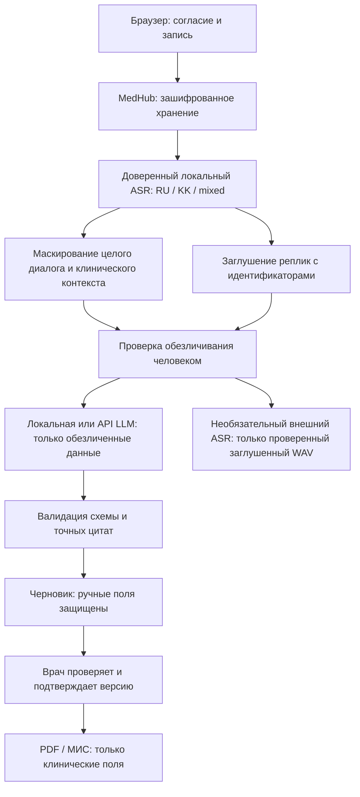

# Конвейер и границы доверия

Доверенный ASR — процесс на сервере, локальном ПК или специально назначенном GPU-ПК через приватный туннель. Self-hosted не означает автоматически безопасный: оператор обязан контролировать его хранение, журналы, ключи и сетевой доступ. Перенаправления HTTP отключены. Облачные ключи не наследуются другими провайдерами.

Идентификационная карточка и медицинский контекст разделены. Перед внешней LLM проверяется именно отправляемый набор данных, включая отредактированные врачом поля. Для облачного анализа требуется актуальная проверка человеком; подписанное согласие само по себе не отключает этот барьер. В пациентском кабинете пациент подтверждает просмотр обезличенной версии перед каждым внешним анализом. После изменения ответов подтверждение устаревает.

Автоматическая вырезка имён в свободной речи ограничена качеством ASR. Если имя не распознано или сказано без маркера, его может не обнаружить детектор. Нельзя заявлять гарантированное обезличивание. Вырезаем целые реплики с временным запасом, потому что точные границы отдельных слов могут ошибаться; оригинал хранится зашифрованно внутри контура и доступен уполномоченному врачу.

Возраст и пол передаются отдельными медицинскими признаками без даты рождения и ИИН. Сексуальный анамнез и заболевания считаются медицинскими данными, сохраняются для анамнеза при наличии согласия; они не должны попадать в технические журналы. Внешние проверки — исключительно синтетические данные.
